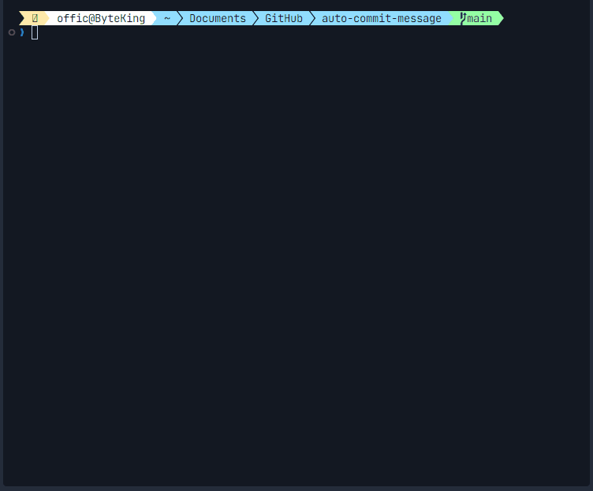

# Auto Commit Message

<div align="center">


</div>

<p align="center">
  
</p>

<p align="center">
  <strong>Automated Conventional Commit Message Generation Powered by Google Gemini AI</strong>
</p>

<p align="center">
  <a href="#overview">Overview</a> •
  <a href="#key-features">Key Features</a> •
  <a href="#installation">Installation</a> •
  <a href="#usage">Usage</a> •
  <a href="#commit-types">Commit Types</a> •
  <a href="#configuration">Configuration</a> •
  <a href="#architecture">Architecture</a> •
  <a href="#contributing">Contributing</a> •
  <a href="#license">License</a>
</p>

---

## Overview

<p align="center">
  
</p>

Auto Commit Message adalah alat canggih yang dirancang untuk meningkatkan alur kerja Git Anda melalui pembuatan pesan commit yang didukung oleh AI. Dengan memanfaatkan model bahasa canggih Google Gemini, aplikasi ini menganalisis perubahan repositori untuk menghasilkan pesan commit yang tepat dan terstandarisasi sesuai dengan praktik terbaik.

Alat ini menjembatani kesenjangan antara pengembangan cepat dan dokumentasi yang komprehensif dengan memastikan setiap pesan commit mempertahankan standar profesional terlepas dari kompleksitas proyek atau ukuran tim.

## Key Features

- **Analisis Perubahan Cerdas**: Secara otomatis mendeteksi dan menginterpretasikan perubahan yang di-stage dalam repositori Git Anda
- **Pesan Berbasis AI**: Menggunakan API Google Gemini untuk menghasilkan pesan commit yang akurat secara kontekstual
- **Kepatuhan Conventional Commit**: Memastikan semua pesan yang dihasilkan mematuhi spesifikasi Conventional Commits
- **Validasi Repositori**: Memverifikasi direktori kerja adalah repositori Git yang valid sebelum eksekusi
- **Konfigurasi Terpusat**: Mempertahankan pengaturan global untuk penggunaan yang konsisten di berbagai proyek
- **Integrasi Perintah Git**: Terintegrasi dengan mulus dengan Git melalui alias kustom untuk alur kerja yang lancar
- **Penanganan Error**: Deteksi dan pelaporan error yang kuat dengan panduan yang jelas untuk penyelesaian
- **Dukungan Lintas Platform**: Kompatibel dengan lingkungan Windows dengan rencana ekspansi ke macOS dan Linux

## Installation

### Prerequisites

- Python 3.7 atau lebih tinggi
- Git versi 2.20 atau lebih tinggi
- Google Gemini API key

### Langkah-langkah Instalasi

1. **Verifikasi Instalasi Python**

   ```sh
   python --version
   ```

   *Jika tidak tersedia, unduh dan instal dari [python.org](https://www.python.org/)*

2. **Clone Repository**

   ```sh
   git clone https://github.com/idugeni/auto-commit-message.git
   cd auto-commit-message
   ```

3. **Instal Dependencies**

   ```sh
   pip install -r requirements.txt
   ```

   atau instal dependencies secara manual:

   ```bash
   pip install google-generativeai
   pip install python-dotenv
   pip install colorlog
   pip install rich
   pip install absl-py
   ```

4. **Konfigurasi Akses API**

   Buat file `.env.local` di direktori proyek Anda:

   ```sh
   GEMINI_API_KEY=your_api_key_here
   ```

   *Catatan: Pastikan file `.env.local` berada di direktori root proyek*

6. **Konfigurasi Git Alias**

   Konfigurasi Git Alias untuk menggunakan script `auto-commit-message`. Anda dapat memilih antara konfigurasi sistem-wide (semua pengguna) atau pengguna-spesifik. Nama alias 'acm' dapat diganti sesuai preferensi Anda, misalnya menjadi 'cm', 'commit-ai', atau nama lain yang Anda inginkan.

   - ***Alias Sistem-Wide (Semua Pengguna)***

   ```sh
   git config --system alias.acm '!python "<path-to-project>/main.py"' --replace-all
   ```

   - ***Alias Pengguna-Spesifik***

   ```sh
   git config --global alias.acm '!python "<path-to-project>/main.py"' --replace-all
   ```

   *Catatan: Ganti `<path-to-project>` dengan path lengkap ke direktori proyek auto-commit-message*

   <details>
     <summary>Troubleshooting</summary>

     Jika Anda mengalami masalah dalam membuat alias Git, opsi `--replace-all` memastikan bahwa setiap alias yang ada dengan nama yang sama akan ditimpa. Jika masalah berlanjut, konsultasikan sumber daya eksternal berikut untuk bantuan lebih lanjut:

     - [How to Set Up Git Aliases](https://dev.to/jsdevspace/how-to-set-up-git-aliases-1hge)

     - [Git Basics - Git Aliases](https://git-scm.com/book/ms/v2/Git-Basics-Git-Aliases)
   </details>

## Usage

### Alur Kerja Standar

1. **Stage Perubahan Anda**

   ```sh
   git add .
   ```

   Atau stage perubahan secara selektif untuk pesan commit yang lebih tepat:

   ```sh
   git add <path/to/modified/files>
   ```

2. **Generate dan Eksekusi Commit**

   Gunakan alias yang telah Anda konfigurasi sebelumnya (misalnya 'acm', 'cm', atau 'commit-ai'):

   ```sh
   git <your-alias>
   # Contoh: git acm, git cm, atau git commit-ai
   ```

   Alat ini akan:
   - Menganalisis perubahan yang di-stage
   - Menghasilkan pesan commit terstruktur
   - Mengeksekusi operasi commit

### Opsi Lanjutan

- **Review Sebelum Commit**: Sistem akan menampilkan pesan commit yang dihasilkan dan meminta konfirmasi
- **Tipe Commit Kustom**: Alat ini mengenali semua tipe commit konvensional standar (lihat [Tipe Commit](#commit-types))

## Commit Types

Auto Commit Message mengikuti [spesifikasi Conventional Commits](https://www.conventionalcommits.org/), mendukung tipe commit berikut:

| Tipe | Deskripsi |
|------|------------|
| `build` | Perubahan yang mempengaruhi sistem build atau dependensi eksternal |
| `ci` | Perubahan pada file dan script konfigurasi CI |
| `chore` | Tugas pemeliharaan rutin dan perubahan kecil |
| `docs` | Perubahan hanya pada dokumentasi |
| `feat` | Pengenalan fitur baru |
| `fix` | Perbaikan bug |
| `perf` | Peningkatan performa |
| `refactor` | Perubahan kode yang tidak memperbaiki bug atau menambah fitur |
| `revert` | Membatalkan commit sebelumnya |
| `style` | Perubahan yang tidak mempengaruhi fungsionalitas kode (pemformatan, dll.) |
| `test` | Menambah atau memperbaiki test |
| `security` | Peningkatan atau perbaikan terkait keamanan |

## Configuration

### Konfigurasi Global

Sistem menggunakan file konfigurasi `.env.local` yang harus dibuat di direktori proyek Anda. File ini berisi parameter berikut:

- `GEMINI_API_KEY`: Kunci autentikasi API Google Gemini Anda

*Catatan Penting:*
- Pastikan untuk membuat file `.env.local` di direktori proyek Anda (bukan di lokasi lain)
- File ini harus berada di level yang sama dengan `main.py`
- Contoh path: `C:/Path/To/Your/auto-commit-message/.env.local`

### Parameter Model

Pengguna tingkat lanjut dapat memodifikasi parameter berikut di `main.py`:

- `temperature`: Mengontrol kreativitas output (0.0 - 1.0)
- `top_p`: Mengontrol keragaman output (0.0 - 1.0)
- `top_k`: Membatasi pilihan token berikutnya
- `max_output_tokens`: Panjang maksimum output yang dihasilkan

## Architecture

Auto Commit Message dibangun dengan arsitektur modular yang terdiri dari komponen utama berikut:

- **GitCommitManager**: Menangani operasi Git dan manajemen repositori
- **AIModelManager**: Mengintegrasikan dengan API Google Gemini untuk generasi pesan
- **EnvironmentManager**: Mengelola konfigurasi dan variabel lingkungan
- **LoggerSetup**: Menyediakan logging terstruktur untuk debugging

## Contributing

Kontribusi sangat diterima! Jika Anda ingin berkontribusi:

1. Fork repositori
2. Buat branch fitur (`git checkout -b feature/AmazingFeature`)
3. Commit perubahan Anda (`git commit -m 'Add some AmazingFeature'`)
4. Push ke branch (`git push origin feature/AmazingFeature`)
5. Buka Pull Request

Pastikan untuk membaca [CONTRIBUTING.md](CONTRIBUTING.md) untuk detail lebih lanjut tentang proses kontribusi kami.

## License

Didistribusikan di bawah Lisensi MIT. Lihat [LICENSE](LICENSE) untuk informasi lebih lanjut.

## Support

Jika Anda menyukai proyek ini, pertimbangkan untuk:
- ⭐ Memberikan bintang di GitHub
- 🐛 Melaporkan bug yang Anda temukan
- 💡 Mengusulkan fitur baru
- 🔀 Membuat pull request untuk perbaikan atau peningkatan

---

<p align="center">Made with ❤️ by <a href="https://github.com/idugeni">idugeni</a></p>