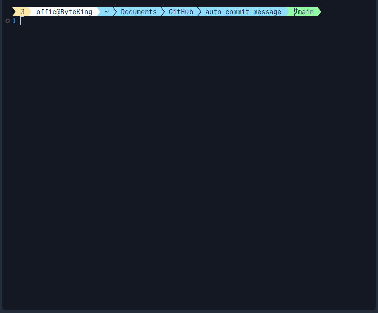

# Auto Commit Message

<div align="center">

<div>


</div>

<div>


</div>

<div>


</div>

</div>

<p align="center">
  
</p>

<p align="center">
  <strong>Automated Conventional Commit Message Generation Powered by Google Gemini AI</strong>
</p>

<p align="center">
  <a href="#overview">Overview</a> •
  <a href="#key-features">Key Features</a> •
  <a href="#installation">Installation</a> •
  <a href="#usage">Usage</a> •
  <a href="#commit-types">Commit Types</a> •
  <a href="#configuration">Configuration</a> •
  <a href="#architecture">Architecture</a> •
  <a href="#contributing">Contributing</a> •
  <a href="#license">License</a>
</p>

---

## Overview

<p align="center">
  
</p>

Auto Commit Message is a sophisticated tool designed to enhance your Git workflow through AI-powered commit message generation. By leveraging Google Gemini's advanced language model, the application analyzes repository changes to produce accurate and standardized commit messages aligned with best practices.

This tool bridges the gap between rapid development and comprehensive documentation by ensuring every commit message maintains professional standards regardless of project complexity or team size.

## Key Features

- **Intelligent Change Analysis**: Automatically detects and interprets staged changes in your Git repository
- **AI-Powered Messages**: Utilizes Google Gemini API to generate contextually accurate commit messages
- **Conventional Commit Compliance**: Ensures all generated messages comply with Conventional Commits specification
- **Repository Validation**: Verifies working directory is a valid Git repository before execution
- **Centralized Configuration**: Maintains global settings for consistent usage across projects
- **Git Command Integration**: Seamlessly integrates with Git through custom aliases for smooth workflow
- **Error Handling**: Robust error detection and reporting with clear resolution guidance
- **Cross-Platform Support**: Compatible with Windows environments with planned expansion to macOS and Linux

## Installation

### Prerequisites

- Python 3.7 or higher
- Git version 2.20 or higher
- Google Gemini API key

### Installation Steps

1. **Verify Python Installation**

   ```sh
   python --version
   ```

   *If not available, download and install from [python.org](https://www.python.org/)*

2. **Clone Repository**

   ```sh
   git clone https://github.com/idugeni/auto-commit-message.git
   cd auto-commit-message
   ```

3. **Install Dependencies**

   ```sh
   pip install -r requirements.txt
   ```

   or install dependencies manually:

   ```bash
   pip install google-generativeai
   pip install python-dotenv
   pip install colorlog
   pip install rich
   pip install absl-py
   ```

4. **Configure API Access**

   Create a `.env.local` file in your project directory:

   ```sh
   GEMINI_API_KEY=your_api_key_here
   ```

   *Note: Ensure `.env.local` is in the project root directory*

6. **Configure Git Alias**

   Configure Git Alias to use the `auto-commit-message` script. You can choose between system-wide (all users) or user-specific configuration. The alias name 'acm' can be replaced according to your preference, such as 'cm', 'commit-ai', or any other name you prefer.

   - ***System-Wide Alias (All Users)***

   ```sh
   git config --system alias.acm '!python "<path-to-project>/main.py"' --replace-all
   ```

   - ***User-Specific Alias***

   ```sh
   git config --global alias.acm '!python "<path-to-project>/main.py"' --replace-all
   ```

   *Note: Replace `<path-to-project>` with the full path to your auto-commit-message project directory*

   <details>
     <summary>Troubleshooting</summary>

     If you experience issues creating Git aliases, the `--replace-all` option ensures that any existing alias with the same name will be overwritten. If problems persist, consult the following external resources for further assistance:

     - [How to Set Up Git Aliases](https://dev.to/jsdevspace/how-to-set-up-git-aliases-1hge)

     - [Git Basics - Git Aliases](https://git-scm.com/book/ms/v2/Git-Basics-Git-Aliases)
   </details>

## Usage

### Standard Workflow

1. **Stage Your Changes**

   ```sh
   git add .
   ```

   Or stage changes selectively for more precise commit messages:

   ```sh
   git add <path/to/modified/files>
   ```

2. **Generate and Execute Commit**

   Use your previously configured alias (e.g., 'acm', 'cm', or 'commit-ai'):

   ```sh
   git <your-alias>
   # Example: git acm, git cm, or git commit-ai
   ```

   The tool will:
   - Analyze staged changes
   - Generate structured commit message
   - Execute commit operation

### Advanced Options

- **Review Before Commit**: System will display generated commit message and request confirmation
- **Custom Commit Types**: Tool recognizes all standard conventional commit types (see [Commit Types](#commit-types))

## Commit Types

Auto Commit Message follows the [Conventional Commits specification](https://www.conventionalcommits.org/), supporting the following commit types:

| Type | Description |
|------|-------------|
| `build` | Changes that affect the build system or external dependencies |
| `ci` | Changes to CI configuration files and scripts |
| `chore` | Routine maintenance tasks and minor changes |
| `docs` | Documentation only changes |
| `feat` | Introduction of new features |
| `fix` | Bug fixes |
| `perf` | Performance improvements |
| `refactor` | Code changes that neither fix bugs nor add features |
| `revert` | Reverting previous commits |
| `style` | Changes that don't affect code functionality (formatting, etc.) |
| `test` | Adding or fixing tests |
| `security` | Security-related improvements or fixes |

## Configuration

### Global Configuration

The system uses a `.env.local` configuration file that must be created in your project directory. This file contains the following parameters:

- `GEMINI_API_KEY`: Your Google Gemini API authentication key

*Important Notes:*
- Make sure to create the `.env.local` file in your project directory (not elsewhere)
- This file must be at the same level as `main.py`
- Example path: `C:/Path/To/Your/auto-commit-message/.env.local`

### Model Parameters

Advanced users can modify the following parameters in `main.py`:

- `temperature`: Controls output creativity (0.0 - 1.0)
- `top_p`: Controls output diversity (0.0 - 1.0)
- `top_k`: Limits next token choices
- `max_output_tokens`: Maximum length of generated output

## Architecture

Auto Commit Message is built with a modular architecture consisting of the following core components:

- **GitCommitManager**: Handles Git operations and repository management
- **AIModelManager**: Integrates with Google Gemini API for message generation
- **EnvironmentManager**: Manages configuration and environment variables
- **LoggerSetup**: Provides structured logging for debugging

## Contributing

Contributions are very welcome! If you'd like to contribute:

1. Fork the repository
2. Create a feature branch (`git checkout -b feature/AmazingFeature`)
3. Commit your changes (`git commit -m 'Add some AmazingFeature'`)
4. Push to the branch (`git push origin feature/AmazingFeature`)
5. Open a Pull Request

Please make sure to read [CONTRIBUTING.md](CONTRIBUTING.md) for details on our contribution process.

## License

Distributed under the MIT License. See [LICENSE](LICENSE) for more information.

## Support

If you like this project, consider:
- ⭐ Giving it a star on GitHub
- 🐛 Reporting bugs you find
- 💡 Suggesting new features
- 🔀 Making a pull request for fixes or improvements

---

<p align="center">Made with ❤️ by <a href="https://github.com/idugeni">idugeni</a></p>